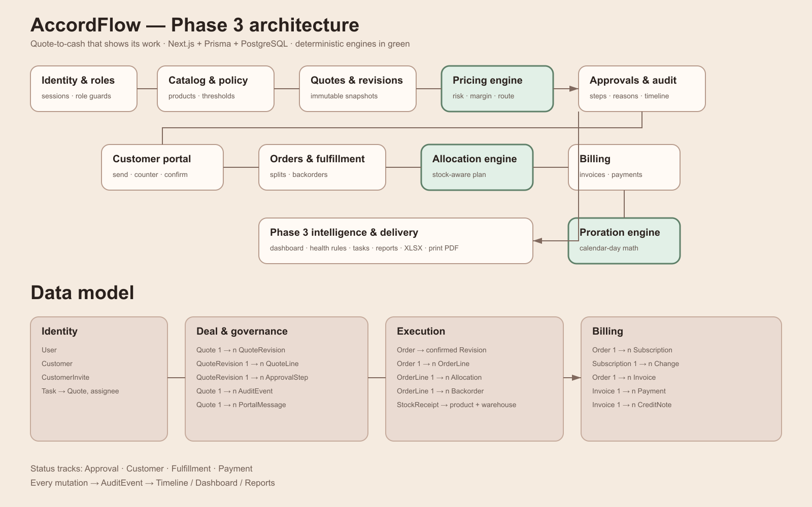
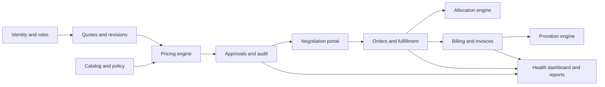

# AccordFlow architecture

AccordFlow is one Next.js application backed by PostgreSQL through Prisma. Server Components read role-scoped data, Server Actions authenticate and validate every mutation, and audit events connect each business action to the quotation timeline. It runs locally without third-party network services.

The three pure engines—pricing, allocation, and proration—accept plain input values and return deterministic outcomes. Database actions then persist those outcomes inside transactions. Critical inventory, approval, confirmation, billing, and payment operations use row locks, serializable transactions, version checks, or unique idempotency keys.

## Data model groups

- Identity: `User`, `Customer`, `CustomerInvite`, `Task`.
- Configuration: `Category`, `Product`, `ProductVariant`, `PriceList`, `DiscountPolicy`, `Warehouse`, `Stock`, `StockReceipt`, `SubscriptionPlan`, `ProductPairing`.
- Deal: `Quote` → many `QuoteRevision` → many `QuoteLine`; one revision is the current immutable snapshot.
- Governance: `QuoteRevision` → many `ApprovalStep`; `AuditEvent` records every meaningful action; `PortalMessage` is scoped by customer and quote.
- Execution: `Order` → many `OrderLine` → many `Allocation` and `Backorder` records.
- Billing: `Order` → `Subscription` → `SubscriptionChange`; `Invoice` → many `InvoiceLine`, `Payment`, and `CreditNote` records.

## Policies and statuses

Policy values live in `DiscountPolicy`: tier ceilings, category ceilings, finance escalation thresholds, stale days, anomaly delta, and upsell margin floor. Four independent status tracks on `Quote` describe approval, customer negotiation, fulfillment, and payment, so one overloaded status cannot hide the real operational state.
